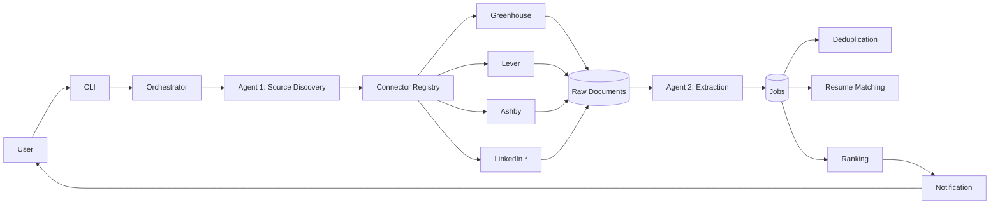
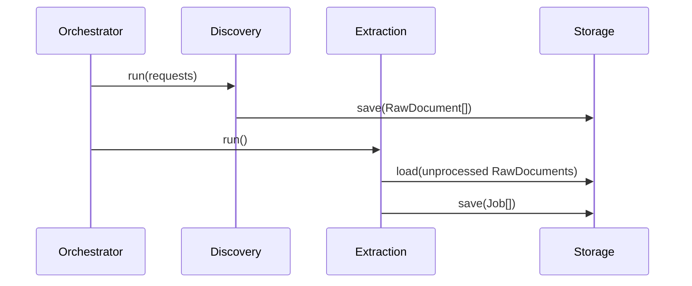

# Job Agent

An extensible, open-source **Job Discovery Platform** that automatically discovers job
opportunities from many sources and routes them through an agent pipeline — extraction,
deduplication, matching, ranking, and notification.

> **Status:** the full pipeline is implemented — Agents 1 (Source Discovery),
> 2 (Job Extraction), 3 (Deduplication), 4 (Resume Matching), 5 (Ranking), and
> 6 (Notification: console + email). A single `run` command executes all agents
> in order.

---

## Project Overview

### The problem

Job seekers spend hours checking dozens of company career pages and job boards, then
manually sifting through postings to find roles that actually match them. Recruiter posts
on social platforms are scattered and unstructured; official career pages are reliable but
spread across many different applicant-tracking systems (ATS).

### Why this exists

**Job Agent** is a *platform*, not a scraper for any single site. It centralizes discovery
across many sources — company career portals first, public job boards, and social signals
(like LinkedIn) as optional supplements — and turns raw postings into ranked,
ready-to-act-on opportunities.

### Design principles

- **Sources are pluggable.** Every data source is a connector behind one interface. The
  pipeline never knows which connector is running.
- **Resilient by default.** If one source (e.g. LinkedIn) is unavailable or blocked, the
  platform keeps working with the others.
- **One agent, one job.** Each stage of the pipeline is an independent, testable agent.

### Architecture overview

The system is a **pipeline of independent agents** that communicate only through typed
models and shared storage.

```mermaid
flowchart TD
    User[User] -->|CLI / config| Orchestrator[Orchestrator]
    Orchestrator --> A1[Agent 1: Source Discovery]
    A1 -->|Connectors| C[Career portals / job boards / LinkedIn]
    C -->|RawDocument[]| A1
    A1 -->|RawDocument[]| RawDB[(Raw Documents)]
    Orchestrator --> A2[Agent 2: Job Extraction]
    A2 -->|Job[]| JobDB[(Structured Jobs)]
    Orchestrator --> A3[Agent 3: Deduplication]
    Orchestrator --> A4[Agent 4: Resume Matching]
    Orchestrator --> A5[Agent 5: Ranking]
    Orchestrator --> A6[Agent 6: Notification]
    A6 --> User
```

### High-level workflow

1. **Discover** — run configured source connectors to fetch raw job postings.
2. **Extract** — parse raw postings into structured `Job` objects.
3. **Deduplicate** — collapse the same role posted across multiple sources.
4. **Match** — compare each job against the user's resume/profile.
5. **Rank** — order by fit and source quality.
6. **Notify** — deliver the shortlist through the configured channel(s).

---

## Architecture

### Agents

Each agent has a single responsibility, described by *what* it does, not *how*.

| # | Agent | Responsibility |
|---|-------|----------------|
| 1 | **Source Discovery** | Execute registered source connectors and collect `RawDocument`s (job postings). Emits raw documents to storage. |
| 2 | **Job Extraction** | Parse each `RawDocument` into a structured `Job` (title, company, location, apply link, type, etc.). |
| 3 | **Deduplication** | Detect and merge the same job discovered across sources using canonical identity keys. |
| 4 | **Resume Matching** | Compare each `Job` against the user's resume/profile and produce a match score. |
| 5 | **Ranking** | Combine match score with source signals (freshness, trust, popularity) into a final order. |
| 6 | **Notification** | Deliver ranked results through configured channels (console + email/SMTP; webhook/Telegram planned). |

### Connectors

A **connector** adapts a single data source to the platform. Every connector implements the
same interface:

```python
class SourceConnector(Protocol):
    platform: SourcePlatform

    async def discover(self, request: DiscoveryRequest) -> list[RawDocument]: ...
```

- **Agent 1 and the scheduler never know which connector they are running** — they iterate
  over the connector registry and a `DiscoveryRequest` derived from configuration.
- Connectors are organized around **applicant-tracking systems (ATS)** first (Greenhouse,
  Lever, Ashby, Workday, SmartRecruiters, iCIMS), which cover many companies with a single
  reusable connector, plus **company-specific** connectors for custom portals.

### LinkedIn

LinkedIn is treated as an **optional, experimental connector** — never a core dependency.
Its reliability is limited by anti-bot protections, login requirements, rate limiting, and
frequent DOM changes. It lives behind the same `SourceConnector` interface, can be disabled
via configuration, and is improved opportunistically without blocking the rest of the
platform.

---

## Folder Structure

```
.
├── src/
│   └── job_agent/                    # The installable package (src layout)
│       ├── agents/                   # One package per pipeline stage
│       │   ├── source_discovery/
│       │   │   ├── agent.py          # Agent 1 orchestration (connector-agnostic)
│       │   │   └── connectors/       # One module per data source
│       │   │       ├── base.py       #   SourceConnector contract
│       │   │       ├── registry.py   #   Connector registry
│       │   │       ├── greenhouse.py #   ATS connectors (reusable across companies)
│       │   │       ├── lever.py
│       │   │       ├── ashby.py
│       │   │       ├── workday.py    #   experimental
│       │   │       ├── amazon.py     #   company-specific
│       │   │       ├── google.py     #   experimental
│       │   │       ├── linkedin.py   #   experimental
│       │   │       └── ...
│       │   ├── job_extraction/       # Agent 2
│       │   │   ├── agent.py
│       │   │   └── parsers/          #   RawDocument -> Job (per source)
│       │   ├── deduplication/        # Agent 3
│       │   │   ├── agent.py
│       │   │   └── keys.py           #   canonical dedup keys
│       │   ├── resume_matching/      # Agent 4
│       │   │   ├── agent.py
│       │   │   └── matcher.py        #   resume -> score
│       │   ├── ranking/              # Agent 5
│       │   │   ├── agent.py
│       │   │   └── ranker.py         #   match + freshness + platform
│       │   └── notification/         # Agent 6
│       │       ├── agent.py
│       │       ├── formatter.py
│       │       └── notifiers/        #   console, email (webhook/telegram planned)
│       ├── models/                   # Pydantic domain models + enums (shared contracts)
│       ├── repositories/             # Persistence adapters behind interfaces
│       ├── services/                 # Cross-cutting infra (http, browser, db, auth)
│       ├── config/                   # Settings + source/connector configuration
│       ├── cli/                      # Typer CLI entry points
│       └── utils/                    # Logging and shared helpers
├── tests/                            # Mirror of src/, pytest + fixtures
├── data/                             # Runtime artifacts (gitignored)
│   ├── raw/                          # Raw scraped documents
│   ├── processed/                    # Normalized/intermediate outputs
│   ├── profiles/                     # Persistent browser profiles (auth state)
│   └── *.db                          # Local SQLite databases
├── pyproject.toml                    # Project metadata, deps, entry points, tool config
├── ruff.toml                         # Lint/format configuration
├── .env.example                      # Documented environment variables
└── README.md
```

### Why this layout

- **`src/` layout** — prevents importing the package without installing it; enables a
  proper `job-agent` console command via `uv sync` / `pip install -e .`.
- **One package per agent** — each agent is independently testable, replaceable, and
  understandable. Adding an agent means adding a folder, never editing existing ones.
- **`connectors/` isolated under `source_discovery/`** — connectors are pure adapters with
  no knowledge of the pipeline; adding a source never touches agent or scheduler code.
- **`models/` shared, not owned** — domain models are the *contract* between agents and are
  framework-free (Pydantic).
- **`repositories/` separate from `services/`** — storage is a first-class concern with a
  stable interface, so swapping SQLite for Postgres never touches agent logic.
- **`data/` gitignored** — runtime state (databases, cookies, scrapes) is never committed.

---

## Development Workflow

### Adding a new source connector

1. Create `src/job_agent/agents/source_discovery/connectors/<name>.py`.
2. Implement the `SourceConnector` protocol:

   ```python
   class MyCompanyConnector(SourceConnector):
       platform = SourcePlatform.COMPANY_CAREERS

       async def discover(self, request: DiscoveryRequest) -> list[RawDocument]: ...
   ```

3. Register it (decorator or explicit registry entry).
4. Add the source's configuration entry (URL, filters, enabled flag).
5. Add tests with a mocked HTTP transport (no real network).

That's it — no changes to Agent 1, the scheduler, or any other connector.

### Adding a new agent

1. Create `src/job_agent/agents/<name>/` with `agent.py` and `__init__.py`.
2. Define its input/output models in `models/`.
3. Implement a single `run()` method that reads from its repository and writes results.
4. Register the agent in the orchestrator.
5. Add tests covering the happy path and failure/retry behavior.

### Adding a new parser

1. Create `src/job_agent/agents/job_extraction/parsers/<name>_parser.py`.
2. Implement the `JobParser` protocol: `parse(raw: RawDocument) -> Job | None`.
3. Register the parser in the extraction agent's parser registry.
4. Add fixture HTML/JSON from the target source and assert the extracted `Job`.

### Adding a new storage backend

1. Implement the repository interface (e.g. `SourceRepository`).
2. Create the new backend (e.g. `PostgresSourceRepository`) with the same methods.
3. Wire it through configuration — agents never import a concrete backend directly.

---

## Coding Guidelines

### Dependency injection

- Agents, services, and connectors receive dependencies through constructors — never
  instantiate a `Database`, HTTP client, or repository *inside* another class.
- A single **composition root** (CLI/bootstrap) builds concrete objects and wires them.
- Prefer **Protocols** (structural typing) over abstract base classes for interfaces.

### Typing

- Full type hints on all public APIs. Python 3.13 modern syntax: `X | None`, built-in
  generics (`list[X]`, `dict[K, V]`).
- Run `mypy` (strict) in CI.
- Validate external data at the boundary with Pydantic models.

### Async usage

- I/O (network, browser, DB) is `async`. Pure logic (parsing, dedup, ranking) stays sync.
- Never block the event loop (`input()`, `time.sleep()`) inside async code.
- Use `asyncio.gather` for independent parallel work (e.g. running multiple connectors).

### Logging

- Structured loggers via `setup_logger(__name__)`. Levels come from settings.
- Use `%s`-style lazy args, not pre-formatted f-strings.
- Never log credentials, cookies, or PII.

### Testing

- `pytest`. Unit-test agents with in-memory SQLite and mocked transports.
- One fixture per external system: `http_client`, `browser`, `database`.
- Contract tests ensure every connector/parser conforms to its protocol.
- No test hits a real external service.

### Linting & formatting

- `ruff` for lint + format. `ruff check .` and `ruff format .` must pass before commit.

### Naming conventions

- `PascalCase` classes, `snake_case` functions/variables, `UPPER_SNAKE` constants.
- Connectors end in `Connector`; agents end in `Agent`; parsers end in `Parser`.

---

## Data Flow

### End-to-end pipeline



### Internal communication

Agents do **not** call each other. They exchange data through shared models and storage:



---

## Sources

### Priority order

**Company career portals and public job boards are the primary sources.** Social signals
(LinkedIn) are optional.

| Tier | Companies |
|------|-----------|
| **Tier 1** | Google, Microsoft, Amazon, Apple, Meta, Atlassian, Uber, Adobe, Salesforce, Databricks |
| **Tier 2** | Cloudflare, MongoDB, Postman, Confluent, Snowflake, Nutanix, Rubrik, Palo Alto Networks, Zscaler, Cisco |
| **FinTech** | Visa, Mastercard, American Express, PayPal, Stripe, Razorpay, PhonePe, Juspay, Pine Labs |
| **Banking GCC** | JPMorgan Chase, Goldman Sachs, Morgan Stanley, Wells Fargo, Barclays, Deutsche Bank, HSBC, BNY, Nasdaq |
| **AI / Enterprise** | OpenAI, SAP, Oracle, ServiceNow, Intuit, VMware (Broadcom) |
| **High-Growth** | Rippling, DevRev, CRED, Meesho, Swiggy, Zomato, Freshworks, Chargebee |

### Connector strategy

Many of these companies use the same applicant-tracking systems, so a single **ATS
connector** covers many companies with zero company-specific code:

- **Greenhouse** — `boards-api.greenhouse.io/v1/boards/{board}/jobs` ✅ verified
- **Lever** — `api.lever.co/v0/postings/{company}?mode=json` ✅ verified
- **Ashby** — `api.ashbyhq.com/posting-api/job-board/{board}` ✅ verified
- **SmartRecruiters** — `api.smartrecruiters.com/v1/companies/{company}/postings` ✅ verified
- **Workday** — `wday/cxs/{tenant}/{site}/jobs` 🧪 experimental (per-tenant tuning)
- **iCIMS** — JSON job APIs (planned)

Company-specific connectors cover custom portals:

- **Amazon** — `amazon.jobs/en/search.json` ✅ verified
- **Google** — `careers.google.com` 🧪 experimental (undocumented API)

`✅ verified` connectors are enabled by default; `🧪 experimental` connectors are disabled
by default and improved over time.

### Currently enabled boards

`src/job_agent/config/sources.yaml` currently enables these verified boards (18 sources):

- **Greenhouse** — Databricks, Cloudflare, MongoDB, Postman, DevRev, PhonePe, Rubrik, Stripe, Zscaler
- **Ashby** — Confluent, Snowflake, OpenAI
- **Lever** — Meesho, CRED
- **SmartRecruiters** — Freshworks, ServiceNow, Swiggy
- **Amazon** (company-specific)

Still **pending** a connector: Google, Microsoft, Apple, Meta, Atlassian, Uber, Adobe,
Salesforce, Oracle, SAP, JPMorgan Chase, Goldman Sachs, Wells Fargo, Morgan Stanley,
American Express, PayPal, Intuit, Visa, Mastercard, Barclays, HSBC, BNY, Nasdaq, Nutanix,
Palo Alto Networks, Cisco, Razorpay, Juspay, Pine Labs, Zomato, Chargebee, and Rippling.
These run on **Workday** (per-tenant API), **custom portals**, or **SuccessFactors/iCIMS**
and each needs dedicated connector work.

### Workday (experimental)

The `workday` connector exists but is **disabled by default**. Workday is per-tenant —
each company uses a different `*.myworkdayjobs.com` host and a site id, and many tenants
sit behind bot protection, so there is no single verified endpoint. To enable it for one
company:

1. Visit the company's careers page and note the URL it lands on, e.g.
   `https://acme.wd5.myworkdayjobs.com/en-US/External`.
2. Add a `workday` source with the matching `host` (`acme.wd5.myworkdayjobs.com`),
   `tenant` (`acme`), and `site` (`External`):
   ```yaml
   - id: workday:acme
     type: workday
     enabled: true
     config:
       host: acme.wd5.myworkdayjobs.com
       tenant: acme
       site: External
   ```
3. Run `job-agent discover` and verify jobs are returned; adjust `site`/`endpoint` if
   the tenant uses a non-standard configuration.

---

## Future Roadmap

### Version 0.1 — Agent 1 complete

- [x] `src/job_agent` package layout + Typer CLI
- [x] `SourceConnector` protocol + connector registry + `DiscoveryRequest`/`RawDocument`
- [x] ATS connectors (Greenhouse, Lever, Ashby verified; Workday experimental)
- [x] Custom connectors (Amazon verified; Google experimental)
- [x] LinkedIn as experimental connector (off by default)
- [x] Repository layer (SQLAlchemy) + config-driven discovery
- [x] Unit tests + contract tests
- [ ] CI (GitHub Actions: ruff + mypy + pytest)

### Version 0.2 — Extraction & matching

- [x] Agent 2 (Job Extraction) + parsers
- [x] Agent 3 (Deduplication)
- [x] Agent 4 (Resume Matching)
- [x] Agent 5 (Ranking)
- [x] Agent 6 (Notification: console + email)
- [x] Orchestrator (`run` command)

### Version 0.3 — Coverage & scale

- [ ] Remaining Tier 1/2 + FinTech + Banking + AI + High-Growth connectors
- [ ] Scheduler / background runs
- [ ] Structured logging + metrics

### Version 1.0 — Production

- [ ] Postgres backend + migrations (Alembic)
- [ ] Configurable pipeline (enable/disable agents, per-source settings)
- [ ] Observability, retries, and failure recovery hardening

### Future ideas

- LLM-assisted extraction/matching for unstructured posts
- Web UI / dashboard
- Third-party connectors via entry points
- Resume vector embeddings + semantic search

---

## Contributing Guide

### Setup

```bash
# 1. Install uv (https://docs.astral.sh/uv/)
# 2. Install dependencies + editable package
uv sync

# 3. Install browser runtime (only needed for the experimental LinkedIn connector)
uv run playwright install chromium

# 4. Configure environment
cp .env.example .env   # then edit values
```

### Running locally

```bash
# Authenticate to LinkedIn once (optional; persists a profile under data/profiles/)
uv run job-agent login

# Run discovery across all enabled sources
uv run job-agent discover

# Extract structured jobs from discovered raw documents
uv run job-agent extract

# Collapse duplicate jobs across sources
uv run job-agent dedupe

# Score canonical jobs against your resume
uv run job-agent match --limit 20

# Rank canonical jobs by match, freshness, and platform
uv run job-agent rank --limit 20

# Send the top-ranked jobs to enabled notification channels
uv run job-agent notify --top 10

# Run the full pipeline in one command
uv run job-agent run --resume-file data/resume.yaml --top 10

# Start the web dashboard (read-only view over the database)
uv run job-agent serve
```

### Your resume

Matching uses a structured YAML profile (`skills`, `roles`, `keywords`, `locations`),
not a PDF. Keep your personal resume at `data/resume.yaml` (gitignored) and reference it:

```bash
uv run job-agent match --resume-file data/resume.yaml
```

Alternatively set `RESUME_FILE=data/resume.yaml` in `.env`. The bundled
`src/job_agent/config/resume.yaml` is only a template for contributors — do not put
personal information there.

### Location filtering

Agent 1 (discovery) can filter fetched postings by location keywords. Add a `locations`
list at the top of `sources.yaml`:

```yaml
locations:
  - remote
  - india
  - bengaluru
  - bangalore
  - kolkata

sources:
  - ...
```

A posting is kept only if its location matches one of the keywords (word-boundary token
match, e.g. `india` matches "Bengaluru, Karnataka, India" but not "Indiana"). Leave the
list empty to disable filtering. Filtering applies to *new* discoveries; previously
stored documents are not retroactively filtered — reset the database if you want a clean
filtered set.

### Role filtering

Agent 4 (Resume Matching) can restrict the final results to engineering-style roles.
Add a `target_roles` list to your `resume.yaml`:

```yaml
target_roles:
  - engineer
  - developer
  - sde
  - data scientist
  - applied scientist
  - software architect
```

A job is ranked/notified only if its title matches one of the keywords. Keep these
precise: `engineer` catches "Software/AI/ML Engineer" but *not* "Engineering Manager"
(token matching), so managers, sales, and design roles are dropped. Leave the list empty
to disable role filtering.

### Web dashboard

`uv run job-agent serve` starts a dashboard at `http://127.0.0.1:8000`
(`--host`/`--port` to change). It reads the same SQLite database the pipeline writes to
and offers:

- an **"All jobs" / "Ranked"** toggle (all jobs shows duplicate/ranked status),
- each row links to the apply URL and shows company, location, type, match score,
  matched skills, and posted date,
- a client-side filter box,
- a **"Run pipeline"** button that runs the full pipeline in the background and shows
  its status,
- **auto-refresh** (default every 20s, via `WEB_REFRESH_SECONDS`) so new entries appear
  automatically.

Built with FastAPI + Jinja2.

### Email notifications (Gmail SMTP)

Email delivery uses SMTP and is free for personal use (Gmail limits ~500 sends/day).

1. Enable **2-Step Verification** on your Google account.
2. Generate an **App Password** (Google Account → Security → App passwords).
3. In `.env`:
   ```bash
   SMTP_HOST=smtp.gmail.com
   SMTP_PORT=587
   SMTP_USER=you@gmail.com
   SMTP_PASSWORD=<16-character app password>
   SMTP_FROM=you@gmail.com
   SMTP_TO=you@gmail.com
   ```
4. Enable the channel in `src/job_agent/config/notifications.yaml`:
   ```yaml
   channels:
     - type: email
       enabled: true
   ```

### Testing

```bash
uv run pytest
uv run ruff check .
uv run ruff format --check .
```

### Adding new connectors

See [Development Workflow](#adding-a-new-source-connector).

### Coding standards

Follow [Coding Guidelines](#coding-guidelines).

### Pull request guidelines

1. One logical change per PR (commit-sized scope).
2. Update documentation if behavior, models, or config change.
3. Add/update tests. Run `ruff` and `pytest` locally.
4. Link related issues; describe motivation in the PR body.
5. No secrets, cookies, databases, or browser profiles committed.
